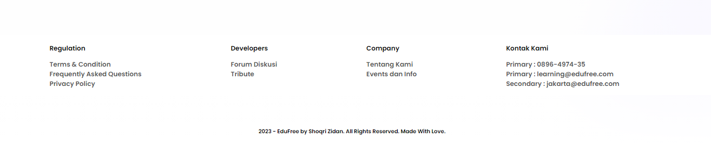

# EduFree Website

## Milestone Project 1 
Hallo, Saya Shoqri Muhammad Zidan dari Team 6, berikut adalah sedikit dokumentasi tentang website yang saya buat.

Berikut Link Website Saya : [EduFree ](https://shoqrizidan.site/)

## Tentang Website Yang Saya Buat 
Saya membuat website bertemakan LMS atau sebuah website pembelajaran, awalan pembuatan dari saya hanya cukup simple dan masih belum banyak section

## Deskripsi

Website EduFree adalah sebuah platform pembelajaran daring yang menyediakan konten pendidikan gratis dan terpercaya. Website ini dirancang untuk memberikan pengalaman belajar yang interaktif dan menyenangkan.

## Fitur

Berikut adalah beberapa fitur yang ada di website EduFree:

### Navigasi Responsif

Navigasi website dapat menyesuaikan tampilan sesuai dengan perangkat yang digunakan pengguna. Navbar berisi tautan ke bagian Program, About, Contact, dan Login.

### Tampilan Awal

Tampilan awal menampilkan header dengan tombol untuk bergabung ke EduFree.

### Konten

Konten pembelajaran disajikan dalam berbagai format, seperti video, kuis, dan sertifikat.

### Program

Menampilkan informasi tentang program pendidikan yang ditawarkan, lengkap dengan deskripsi, gambar, dan tautan untuk melihat lebih lanjut.

### Mentor

Pengguna dapat belajar dari mentor-mentor terkemuka dalam bidang mereka.

### Kutipan dan Tentang

Menampilkan kutipan inspiratif dan informasi tentang EduFree, beserta tautan untuk mendaftar.

### Artikel

Menyediakan artikel-artikel menarik yang dapat dibaca pengguna.

### Join

Sebuah kontainer yang mengarahkan pengguna untuk bergabung dengan EduFree.

### Footer Informatif

Footer website berisi bagian untuk regulasi, pengembang, perusahaan, dan kontak.

## Kontak

Jika Anda memiliki pertanyaan atau saran terkait proyek ini, silakan hubungi saya.

---

2023 - EduFree by Shoqri Zidan. All Rights Reserved. Made With Love.
