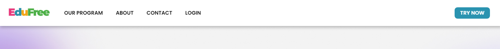
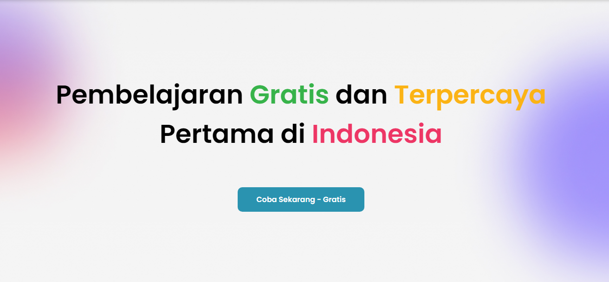
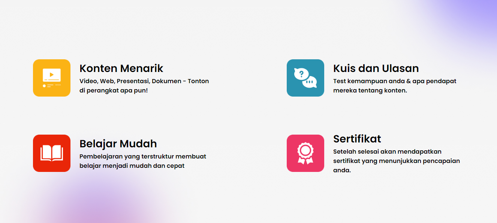
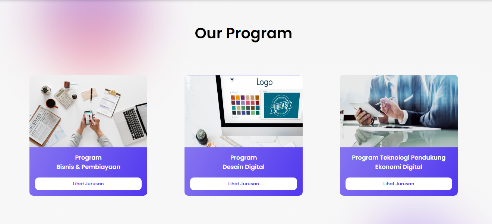
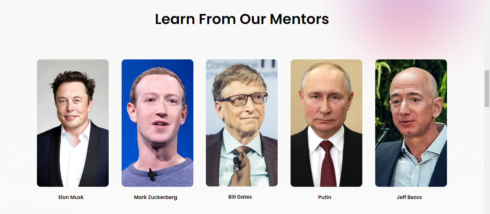
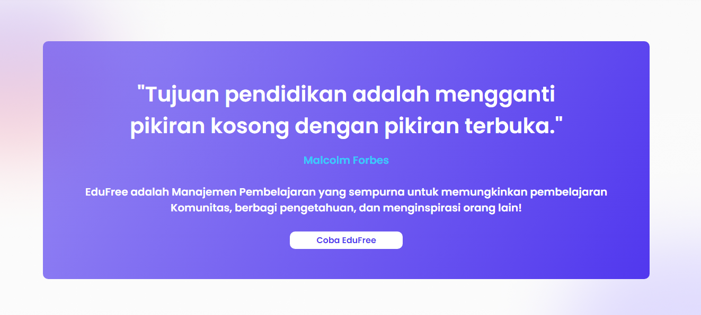
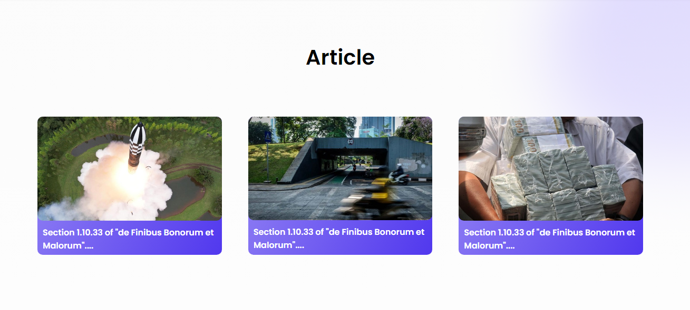
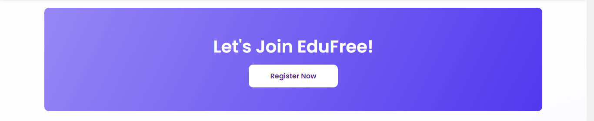

# Milestone Project 1 
### Hallo, Saya Shoqri Muhammad Zidan dari Team 6, berikut adalah sedikit dokumentasi tentang website yang saya buat.

#### -- Tentang Website Yang Saya Buat --
Saya membuat website bertemakan LMS atau sebuah website pembelajaran, awalan pembuatan dari saya hanya cukup simple dan masih belum banyak section
#### -- Deskripsi --
Website EduFree adalah sebuah platform pembelajaran daring yang menyediakan konten pendidikan gratis dan terpercaya. Website ini dirancang untuk memberikan pengalaman belajar yang interaktif dan menyenangkan.

## Section & Fitur
Berikut adalah beberapa section yang saya taruh di website EduFree:

- **Navigasi Responsif**: Navigasi website dapat menyesuaikan tampilan sesuai dengan perangkat yang digunakan pengguna. yang dimana navbar ini berisi link ke arah Program, About, Contact dan Login.
  
- **Tampilan Awal** : Tampilan Awal, Dibawahnya terdapat tombol untuk bergabung ke EduFree
  
- **Konten**: Konten pembelajaran yang disajikan dalam berbagai format, seperti video, kuis, dan sertifikat. Pengguna dapat dengan mudah mengakses dan menonton konten tersebut.
  
- **Program**: Website menyediakan informasi tentang program pendidikan yang ditawarkan. Setiap program dilengkapi dengan deskripsi, gambar, dan tombol tautan untuk melihat lebih lanjut.
  
- **Mentor**: Pengguna dapat belajar dari mentor-mentor terkemuka dalam bidang mereka. Setiap mentor memiliki foto dan nama yang ditampilkan.
  
- **Kutipan dan Tentang**: Di bagian kutipan dan tentang, terdapat kutipan inspiratif yang memotivasi pengguna untuk terus belajar dan berkembang. Terdapat juga sedikit tentang Edufree dan tautan untuk mendaftar.
  
- **Artikel**: Website juga menyediakan artikel-artikel menarik yang dapat dibaca pengguna. Setiap artikel dilengkapi dengan gambar dan judul yang menggugah minat.
  
- **Join** : Sebelum ke Footer terdapat sebuah container yang mengarahkan kita untuk bergabung EduFree
  
- **Footer Informatif**: Footer website berisi bagian untuk regulasi, pengembang, perusahaan, dan kontak. Pengguna dapat dengan mudah menemukan informasi tersebut di bagian bawah halaman.
  

## Kontak

Jika Anda memiliki pertanyaan atau saran terkait proyek ini, silakan hubungi saya terimakasihh.

---

2023 - EduFree by Shoqri Zidan. All Rights Reserved. Made With Love.
